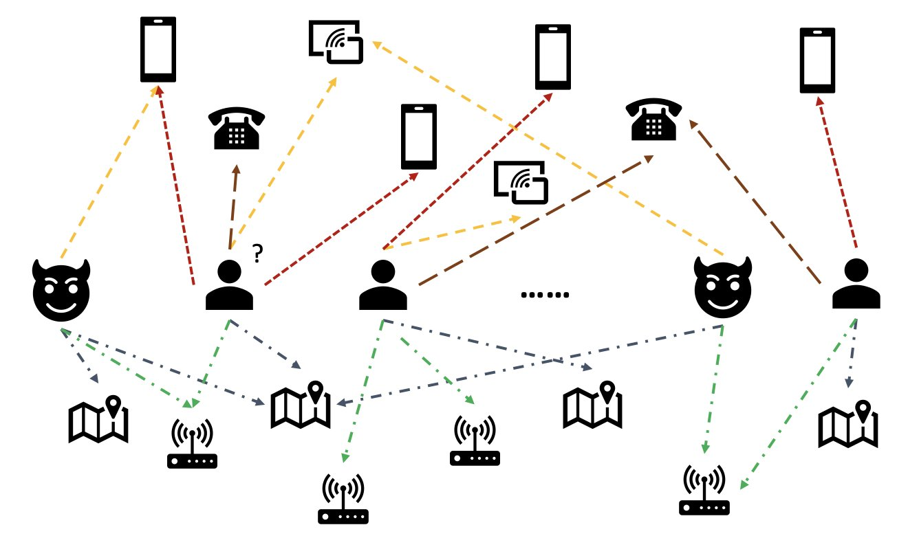

# Graph ML Final Project'
## Author: Collin Quinn, Feb 2023

#### Introduction: 
Fraudulent activities severely impact many industries (i.e., e-commerce, social media, financial services), where users disguise as regular users to bypass anti-fraud systems to disperse disinformation or reap other end-user's privacy . In fact, American consumers reported losing more than $5.8 billion to frauds in 2021, up more than 70% over 2020. Many techniques have been used to detect fraudsters—rule-based filters, anomaly detection, and machine learning (ML) models, to name a few. However, these traditional/previous methods have not been sophisticated or flexible enough to detect the whole spectrum of suspicious online behaviors. For example, anyone who has browsed e-commerece websites such as Yelp or Amazon has likely come across a few product reviews that look a bit suspicious.

Now to introduce the concept of graph machine learning, which is the approach we are using in this report. In real-world data, entities often involve rich relationships with other entities. From these relationships, a graph structure can provide valuable information for anomaly detection. For example, in the following figure, users are connected via shared entities such as Wi-Fi IDs, physical locations, and phone numbers. Due to the large number of unique values of these entities, like phone numbers, it’s difficult to use them in the traditional feature-based models—for example, one-hot encoding all phone numbers wouldn’t be viable. But such relationships could help predict whether a user is a fraudster. If a user has shared several entities with a known fraudster, the user is more likely a fraudster.

#### Abstract:
As discussed in the introduction, fraudelent activity for companies causes huge problems for both the companies and end users, costing billions of dollars in losses. Therefore, the ability to solve such an issue reaps huge rewards, especially since traditional methods of solving this issue aren't quite sophisticated enough. However, when reading the original [paper](https://arxiv.org/pdf/2008.08692.pdf) and [codebase](https://github.com/YingtongDou/CARE-GNN), they mentioned they used the Adam optimizer, but did not provide an explanation of why, and did not mention they tried any other alertnatives. Therefore, it was my goal to try different optimizers to see if I can improve upon their results. 

*Hypothesis: If I experiment with several other optimizers, then I can improve the fraud detection performance results on the Yelp dataset.* 

#### Methods:
In this project, we are using graph machine learning to look at false reviews on a Yelp dataset, which includes hotel and restaurant reviews filtered (spam) and recommended (legitimate) by Yelp. Based on previous studies which show that opinion fraudsters have connections in user, product, review text, and time, we take reviews as nodes in the graph and design three relations: 1) R-U-R: it connects reviews posted by the same user; 2) R-S-R: it connects reviews under the same product with the same star rating (1-5 stars); 3) R-T-R: it connects two reviews under the same product posted in the same month.

I am using different optimizers as experiments. This includes Aadamax, RMSprop, SGD w/ momentum, Adadelta, Adagrad, NAdam, RAdam, Rprop, and ASGD.The default optimization technique the paper used was the Adam optimizer. I kept all other hyperparameters constant. 

#### Results:    [Results_Final PDF](https://github.com/ryn8raun248/GraphML_Final_Project/blob/main/Results_Final.pdf)

#### Conclusion:

#### Reproducing Results:
See [Readme](https://github.com/ryn8raun248/GraphML_Final_Project/tree/main/code#running) for reproducing results. Note that the code in this repository is cited below. The code does include the modifications to the code that I did for the project, which can be noted  [here](https://github.com/ryn8raun248/GraphML_Final_Project/commit/138e66a31973531d9f3211dcd14a2f137404dcc2).

#### Sources:

Original Paper: [Enhancing Graph Neural Network-based Fraud Detectors against Camouflaged Fraudsters](https://arxiv.org/pdf/2008.08692.pdf)

For orignal code, we used the follwing source. Minor tweaks were added to this code to change optimizers. You can see the changes I made to the original code [here](https://github.com/ryn8raun248/GraphML_Final_Project/commit/138e66a31973531d9f3211dcd14a2f137404dcc2).

@inproceedings{dou2020enhancing,
  title={Enhancing Graph Neural Network-based Fraud Detectors against Camouflaged Fraudsters},
  author={Dou, Yingtong and Liu, Zhiwei and Sun, Li and Deng, Yutong and Peng, Hao and Yu, Philip S},
  booktitle={Proceedings of the 29th ACM International Conference on Information and Knowledge Management (CIKM'20)},
  year={2020}
}

[Codebase](https://github.com/YingtongDou/CARE-GNN) |
[Amazon Blog](https://aws.amazon.com/blogs/machine-learning/build-a-gnn-based-real-time-fraud-detection-solution-using-amazon-sagemaker-amazon-neptune-and-the-deep-graph-library/) |
[YelpChi Dataset](https://paperswithcode.com/dataset/yelpchi)

